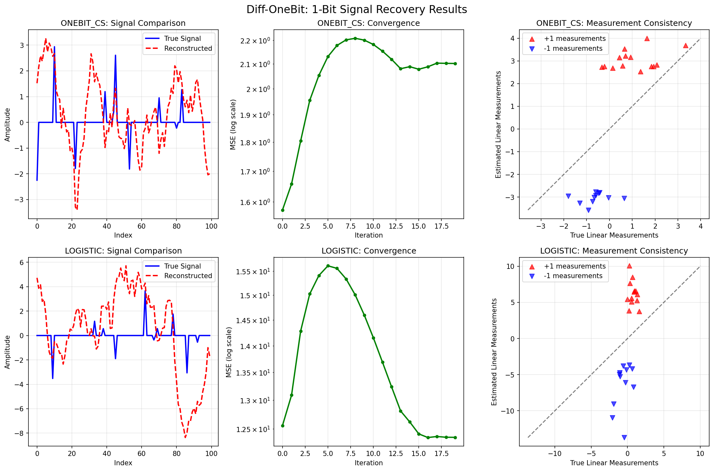
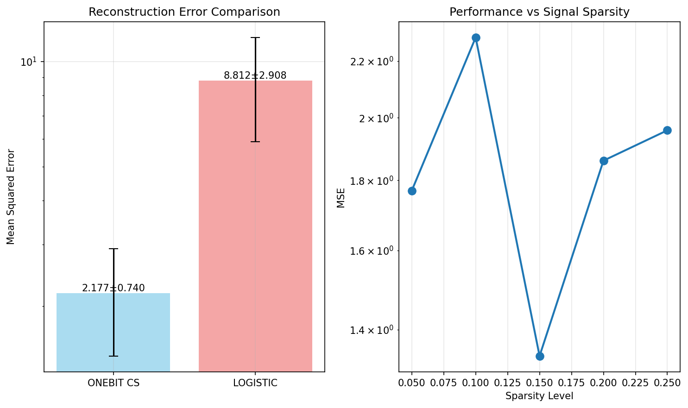

# Diffusion Model Based Signal Recovery Under 1-Bit Quantization

## Paper Reference

**"Diffusion Model Based Signal Recovery Under 1-Bit Quantization"**

**Authors:** [Youming Chen](https://arxiv.org/search/?searchtype=author&query=Youming%20Chen), [Zhaoqiang Liu](https://arxiv.org/search/?searchtype=author&query=Zhaoqiang%20Liu)

**ArXiv:** [2511.12471v1](https://arxiv.org/abs/2511.12471v1)

## Abstract

> Diffusion models (DMs) have demonstrated to be powerful priors for signal recovery, but their application to 1-bit quantization tasks, such as 1-bit compressed sensing and logistic regression, remains a challenge. This difficulty stems from the inherent non-linear link function in these tasks, which is either non-differentiable or lacks an explicit characterization. To tackle this issue, we introduce Diff-OneBit, which is a fast and effective DM-based approach for signal recovery under 1-bit quantization. Diff-OneBit addresses the challenge posed by non-differentiable or implicit links functions via leveraging a differentiable surrogate likelihood function to model 1-bit quantization, thereby enabling gradient based iterations. This function is integrated into a flexible plug-and-play framework that decouples the data-fidelity term from the diffusion prior, allowing any pretrained DM to act as a denoiser within the iterative reconstruction process. Extensive experiments on the FFHQ, CelebA and ImageNet datasets demonstrate that Diff-OneBit gives high-fidelity reconstructed images, outperforming state-of-the-art methods in both reconstruction quality and computational efficiency across 1-bit compressed sensing and logistic regression tasks.

## Description

Implementation of Diff-OneBit algorithm for signal recovery under 1-bit quantization using diffusion model priors

## Implementation

See [`Diff_OneBit_arxiv_2511_12471v1.py`](./Diff_OneBit_arxiv_2511_12471v1.py) for the full implementation.

## Results

### Figure 1

### Figure 2

