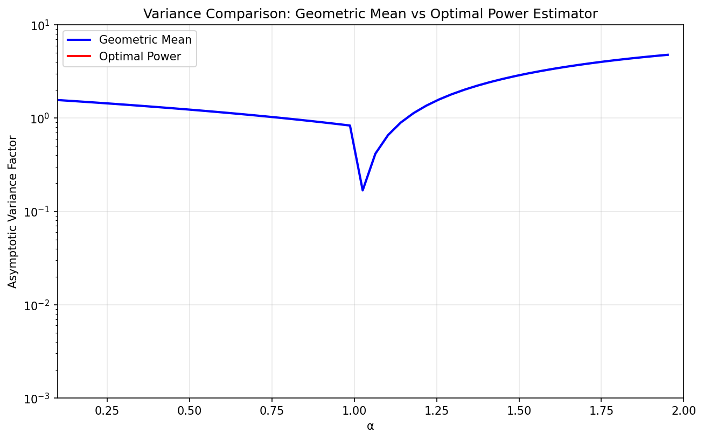
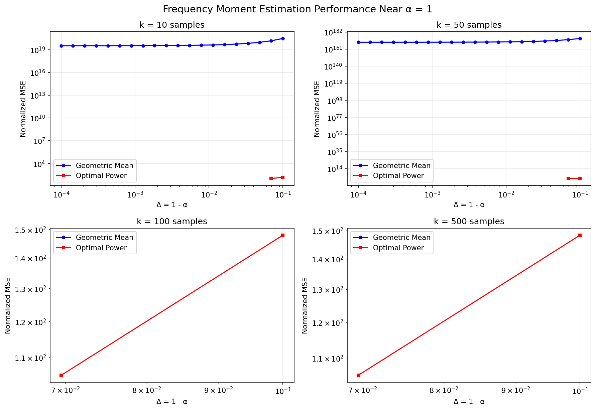
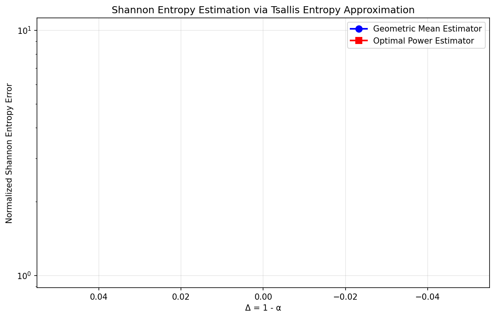

# Improving Compressed Counting

## Paper Reference

**"Improving Compressed Counting"**

**Authors:** [Ping Li](https://arxiv.org/search/?searchtype=author&query=Ping%20Li)

**ArXiv:** [1205.2632v1](https://arxiv.org/abs/1205.2632v1)

## Abstract

> Compressed Counting (CC) [22] was recently proposed for estimating the ath frequency moments of data streams, where 0 < a <= 2. CC can be used for estimating Shannon entropy, which can be approximated by certain functions of the ath frequency moments as a -> 1. Monitoring Shannon entropy for anomaly detection (e.g., DDoS attacks) in large networks is an important task. This paper presents a new algorithm for improving CC. The improvement is most substantial when a -> 1--. For example, when a = 0:99, the new algorithm reduces the estimation variance roughly by 100-fold. This new algorithm would make CC considerably more practical for estimating Shannon entropy. Furthermore, the new algorithm is statistically optimal when a = 0.5.

## Description

Implementation of the optimal power estimator for Compressed Counting algorithm to estimate frequency moments and Shannon entropy of data streams

## Implementation

See [`Improved_Compressed_Counting_arxiv_1205_2632v1.py`](./Improved_Compressed_Counting_arxiv_1205_2632v1.py) for the full implementation.

## Results

### Figure 1

### Figure 2

### Figure 3

