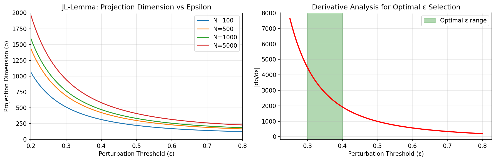
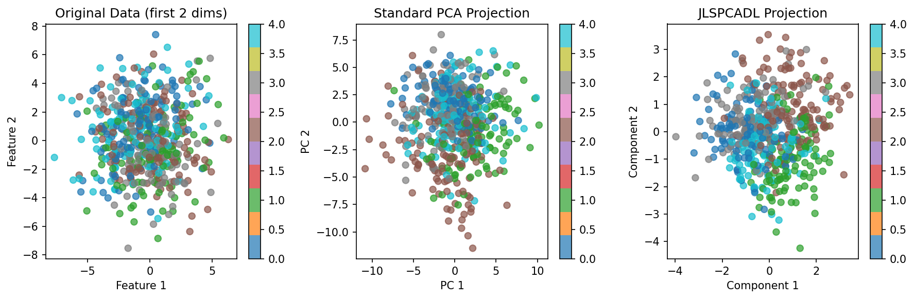
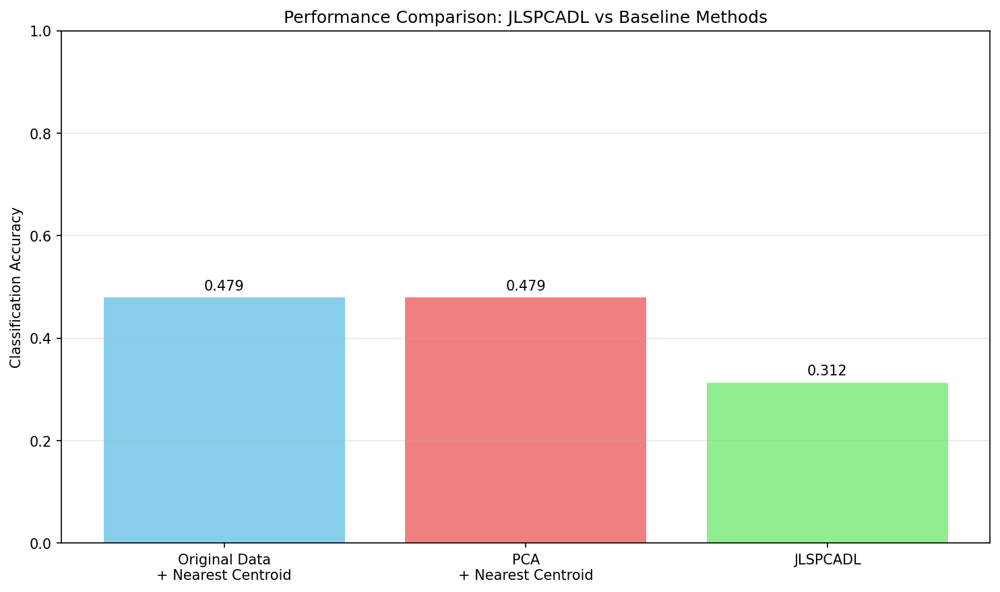

# Optimal Projections for Discriminative Dictionary Learning using the JL-lemma

## Paper Reference

**"Optimal Projections for Discriminative Dictionary Learning using the JL-lemma"**

**Authors:** [G. Madhuri](https://arxiv.org/search/?searchtype=author&query=G.%20Madhuri), [Atul Negi](https://arxiv.org/search/?searchtype=author&query=Atul%20Negi), [Kaluri V. Rangarao](https://arxiv.org/search/?searchtype=author&query=Kaluri%20V.%20Rangarao)

**ArXiv:** [2308.13991](https://arxiv.org/abs/2308.13991)

## Abstract

> Dimensionality reduction-based dictionary learning methods in the literature have often used iterative random projections. The dimensionality of such a random projection matrix is a random number that might not lead to a separable subspace structure in the transformed space. The convergence of such methods highly depends on the initial seed values used. Also, gradient descent-based updates might result in local minima. This paper proposes a constructive approach to derandomize the projection matrix using the Johnson-Lindenstrauss lemma. Rather than reducing dimensionality via random projections, a projection matrix derived from the proposed Modified Supervised PC analysis is used. A heuristic is proposed to decide the data perturbation levels and the dictionary atom's corresponding suitable description length. The projection matrix is derived in a single step, provides maximum feature-label consistency of the transformed space, and preserves the geometry of the original data. The projection matrix thus constructed is proved to be a JL-embedding. Despite confusing classes in the OCR datasets, the dictionary trained in the transformed space generates discriminative sparse coefficients with reduced complexity. Empirical study demonstrates that the proposed method performs well even when the number of classes and dimensionality increase. Experimentation on OCR and face recognition datasets shows better classification performance than other algorithms.

## Description

Implementation of JLSPCADL: Johnson-Lindenstrauss lemma based optimal projections for discriminative dictionary learning with Modified Supervised PCA

## Implementation

See [`JLSPCADL_arxiv_2308_13991.py`](./JLSPCADL_arxiv_2308_13991.py) for the full implementation.

## Results

### Figure 1

### Figure 2

### Figure 3

