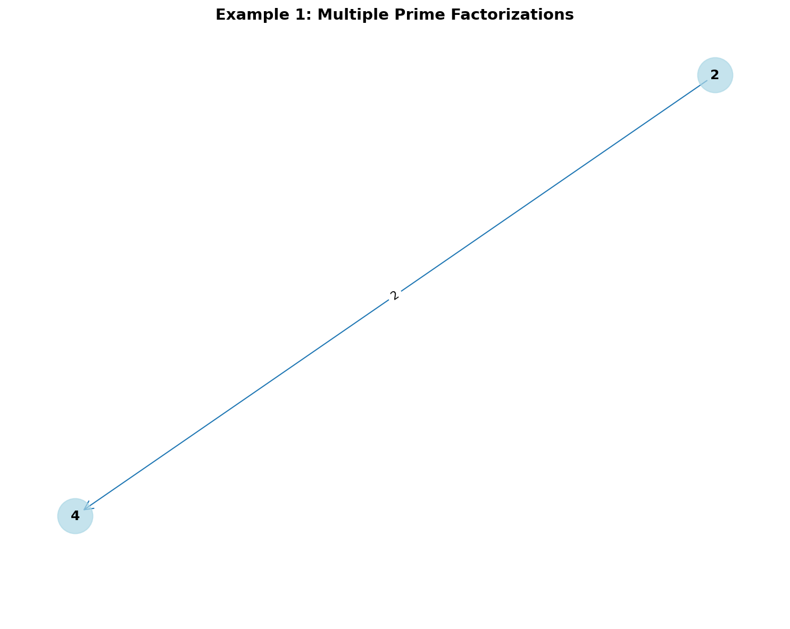
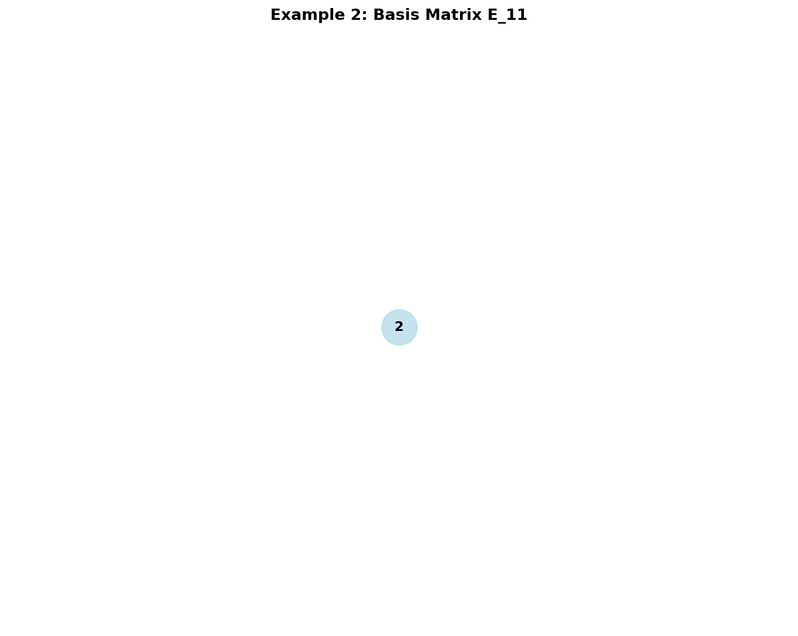
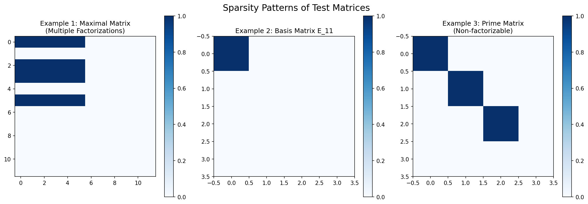

# Identifying Kronecker product factorizations

## Paper Reference

**"Identifying Kronecker product factorizations"**

**Authors:** [Yannis Voet](https://arxiv.org/search/?searchtype=author&query=Yannis%20Voet), [Leonardo De Novellis](https://arxiv.org/search/?searchtype=author&query=Leonardo%20De%20Novellis)

**ArXiv:** [2510.25292](https://arxiv.org/abs/2510.25292)

## Abstract

> The Kronecker product is an invaluable tool for data-sparse representations of large networks and matrices with countless applications in machine learning, graph theory and numerical linear algebra. In some instances, the sparsity pattern of large matrices may already hide a Kronecker product. Similarly, a large network, represented by its adjacency matrix, may sometimes be factorized as a Kronecker product of smaller adjacency matrices. In this article, we determine all possible Kronecker factorizations of a binary matrix and visualize them through its decomposition graph. Such sparsity-informed factorizations may later enable good (approximate) Kronecker factorizations of real matrices or reveal the latent structure of a network. The latter also suggests a natural visualization of Kronecker graphs.

## Description

Implementation of algorithms for identifying all possible Kronecker product factorizations of binary matrices, including decomposition graph visualization and applications to sparse matrix analysis.

## Implementation

See [`Kronecker_Product_Factorization_arxiv_2510_25292.py`](./Kronecker_Product_Factorization_arxiv_2510_25292.py) for the full implementation.

## Results

### Figure 1

### Figure 2

### Figure 3

