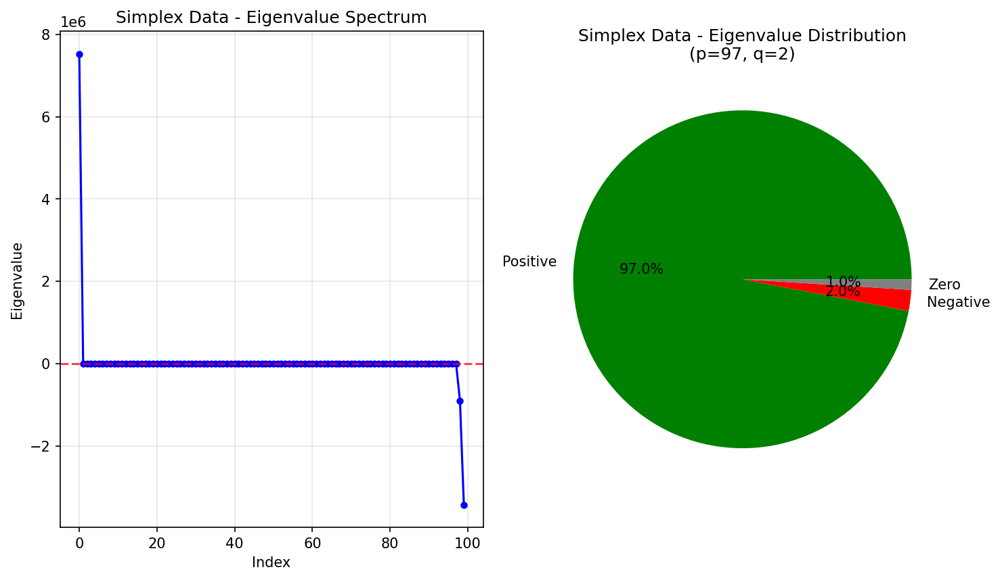
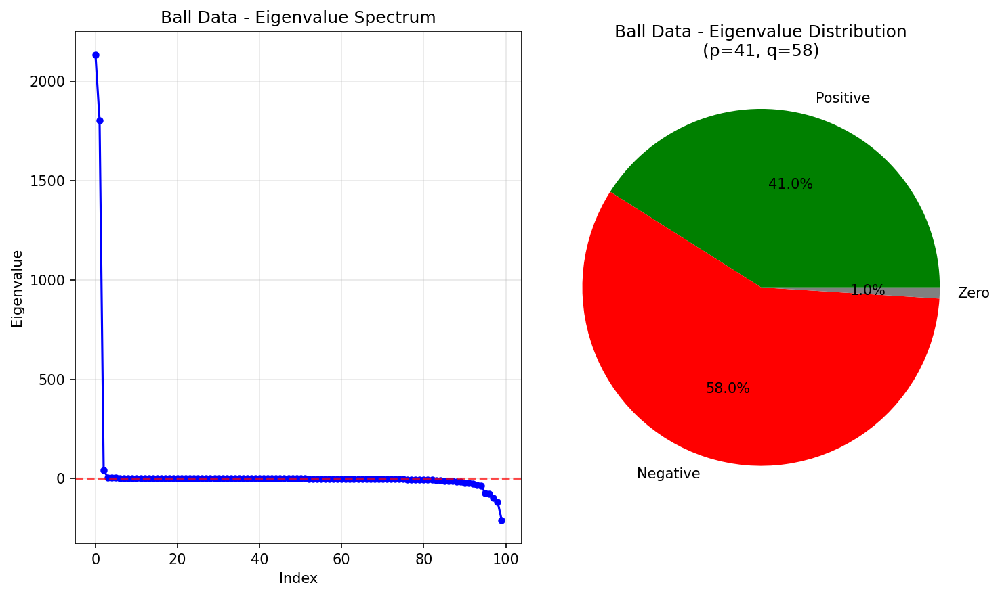
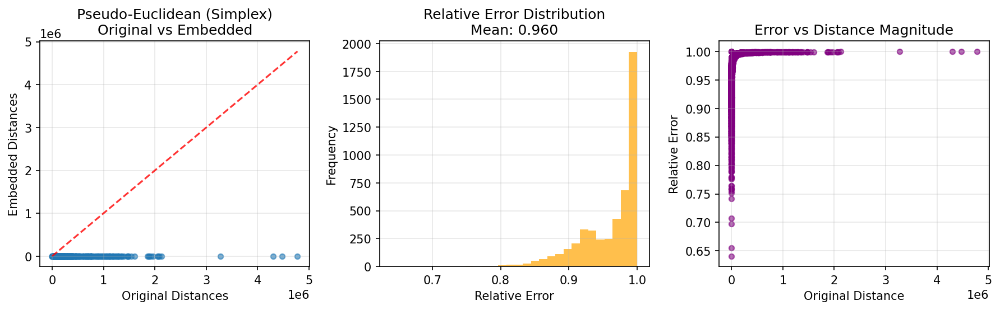
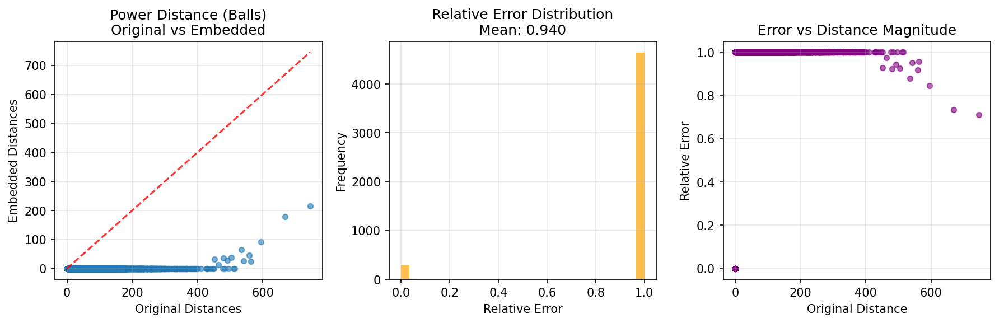
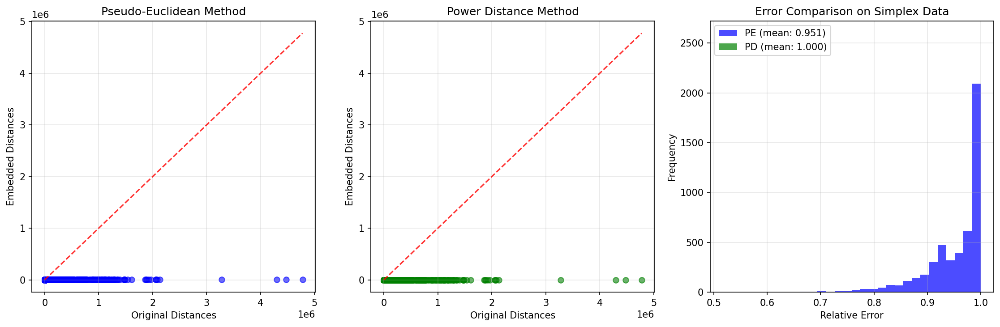

# Johnson-Lindenstrauss Lemma Beyond Euclidean Geometry

## Authors

- [Chengyuan Deng](https://arxiv.org/search/?searchtype=author&query=Chengyuan%20Deng)
- [Jie Gao](https://arxiv.org/search/?searchtype=author&query=Jie%20Gao)
- [Kevin Lu](https://arxiv.org/search/?searchtype=author&query=Kevin%20Lu)
- [Feng Luo](https://arxiv.org/search/?searchtype=author&query=Feng%20Luo)
- [Cheng Xin](https://arxiv.org/search/?searchtype=author&query=Cheng%20Xin)

**ArXiv:** [2510.22401](https://arxiv.org/abs/2510.22401)

## Abstract

The Johnson-Lindenstrauss (JL) lemma is a cornerstone of dimensionality reduction in Euclidean space, but its applicability to non-Euclidean data has remained limited. This paper extends the JL lemma beyond Euclidean geometry to handle general dissimilarity matrices that are prevalent in real-world applications. We present two complementary approaches: First, we show the JL transform can be applied to vectors in pseudo-Euclidean space with signature $(p,q)$, providing theoretical guarantees that depend on the ratio of the $(p, q)$ norm and Euclidean norm of two vectors, measuring the deviation from Euclidean geometry. Second, we prove that any symmetric hollow dissimilarity matrix can be represented as a matrix of generalized power distances, with an additional parameter representing the uncertainty level within the data. In this representation, applying the JL transform yields multiplicative approximation with a controlled additive error term proportional to the deviation from Euclidean geometry. Our theoretical results provide fine-grained performance analysis based on the degree to which the input data deviates from Euclidean geometry, making practical and meaningful reduction in dimensionality accessible to a wider class of data. We validate our approaches on both synthetic and real-world datasets, demonstrating the effectiveness of extending the JL lemma to non-Euclidean settings.

## Description

Implementation of Johnson-Lindenstrauss transforms for non-Euclidean data using pseudo-Euclidean space and generalized power distance representations

## Implementation

See [`Non_Euclidean_Johnson_Lindenstrauss_arxiv_2510_22401.py`](./Non_Euclidean_Johnson_Lindenstrauss_arxiv_2510_22401.py) for the full implementation.

## Results

### Figure 1

### Figure 2

### Figure 3

### Figure 4

### Figure 5

