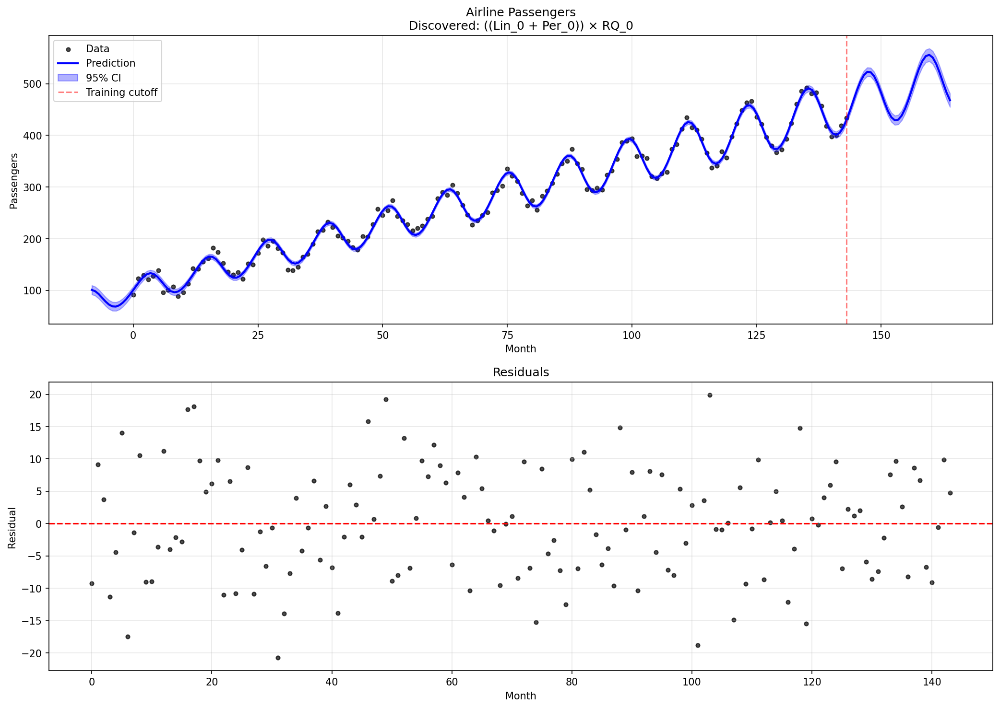
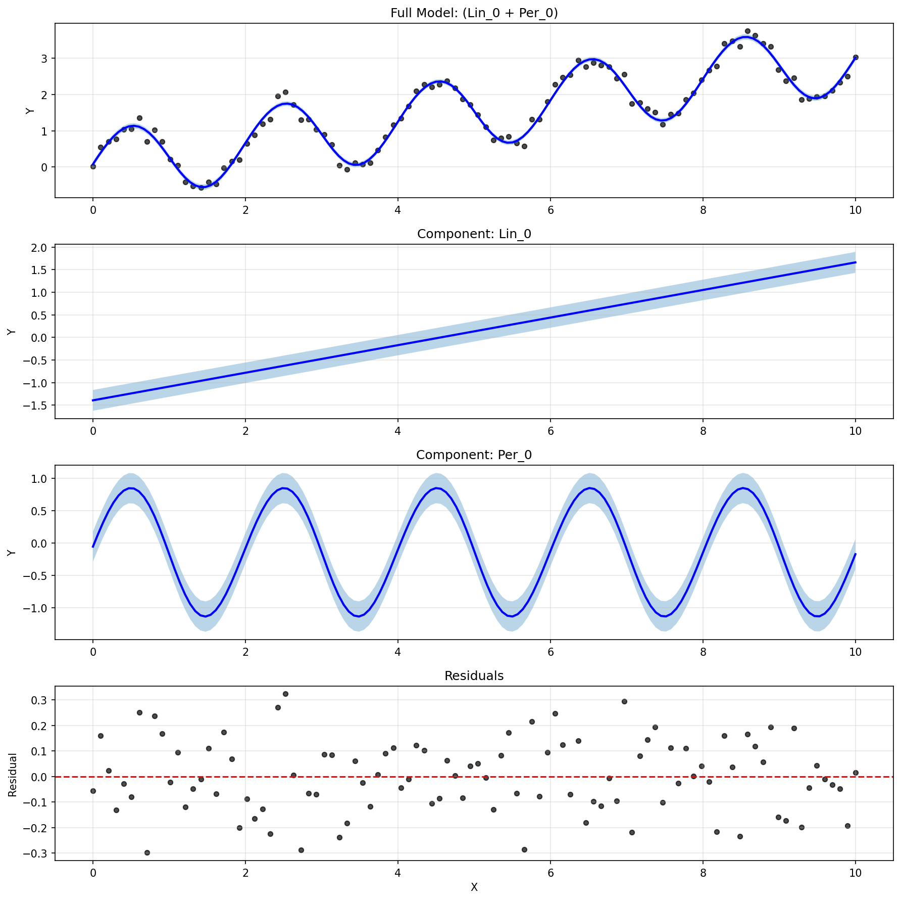
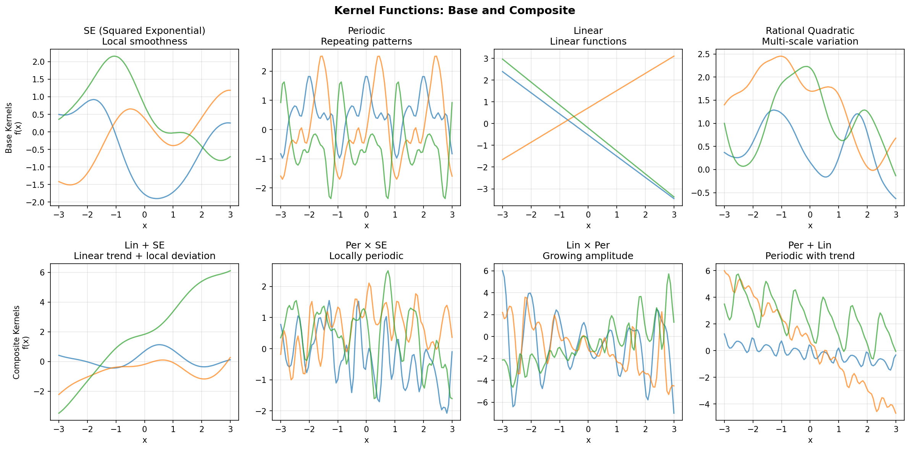

# CKS - Compositional Kernel Search

This repository contains an implementation of the Compositional Kernel Search algorithm for automatic structure discovery in time series and regression data using Gaussian Processes.

## Reference

This is an implementation of the algorithms described in:

**"Structure Discovery in Nonparametric Regression through Compositional Kernel Search"**

David Duvenaud, James Robert Lloyd, Roger Grosse, Joshua B. Tenenbaum, Zoubin Ghahramani

*Proceedings of the 30th International Conference on Machine Learning (ICML), 2013*

Paper: [https://arxiv.org/abs/1302.4922](https://arxiv.org/abs/1302.4922)

## Contents

- `compositional_kernel_search.py` - Main implementation of the CKS algorithm
- `examples.py` - Example usage and demonstrations

## Examples

