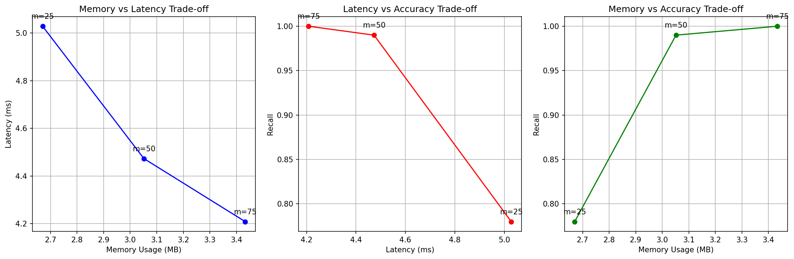
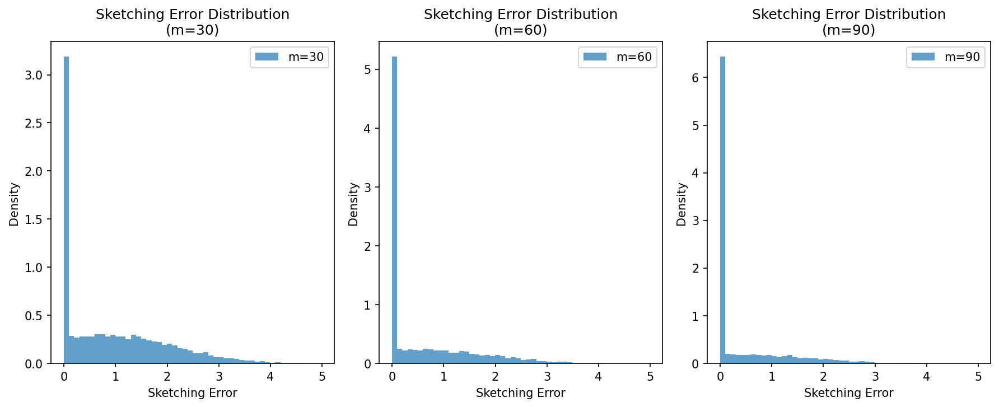

# An Approximate Algorithm for Maximum Inner Product Search over Streaming Sparse Vectors

## Paper Reference

**"An Approximate Algorithm for Maximum Inner Product Search over Streaming Sparse Vectors"**

**Authors:** [Sebastian Bruch](https://arxiv.org/search/?searchtype=author&query=Sebastian%20Bruch), [Franco Maria Nardini](https://arxiv.org/search/?searchtype=author&query=Franco%20Maria%20Nardini), [Amir Ingber](https://arxiv.org/search/?searchtype=author&query=Amir%20Ingber), [Edo Liberty](https://arxiv.org/search/?searchtype=author&query=Edo%20Liberty)

**ArXiv:** [2301.10622v1](https://arxiv.org/abs/2301.10622v1)

## Abstract

> Maximum Inner Product Search or top-k retrieval on sparse vectors is well-understood in information retrieval, with a number of mature algorithms that solve it exactly. However, all existing algorithms are tailored to text and frequency-based similarity measures. To achieve optimal memory footprint and query latency, they rely on the near stationarity of documents and on laws governing natural languages. We consider, instead, a setup in which collections are streaming -- necessitating dynamic indexing -- and where indexing and retrieval must work with arbitrarily distributed real-valued vectors. As we show, existing algorithms are no longer competitive in this setup, even against naive solutions. We investigate this gap and present a novel approximate solution, called Sinnamon, that can efficiently retrieve the top-k results for sparse real valued vectors drawn from arbitrary distributions. Notably, Sinnamon offers levers to trade-off memory consumption, latency, and accuracy, making the algorithm suitable for constrained applications and systems. We give theoretical results on the error introduced by the approximate nature of the algorithm, and present an empirical evaluation of its performance on two hardware platforms and synthetic and real-valued datasets. We conclude by laying out concrete directions for future research on this general top-k retrieval problem over sparse vectors.

## Description

Implementation of Sinnamon algorithm for approximate Maximum Inner Product Search over streaming sparse vectors using probabilistic sketches

## Implementation

See [`Sinnamon_SMIPS_arxiv_2301_10622v1.py`](./Sinnamon_SMIPS_arxiv_2301_10622v1.py) for the full implementation.

## Results

### Figure 1

### Figure 2

