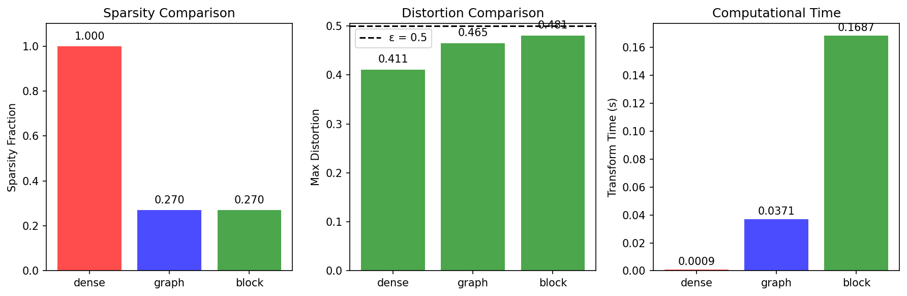
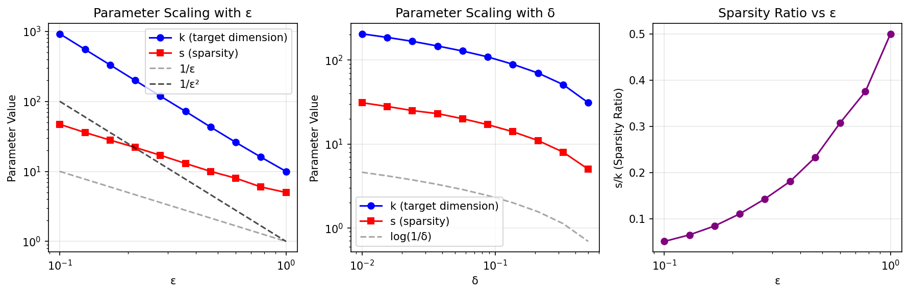
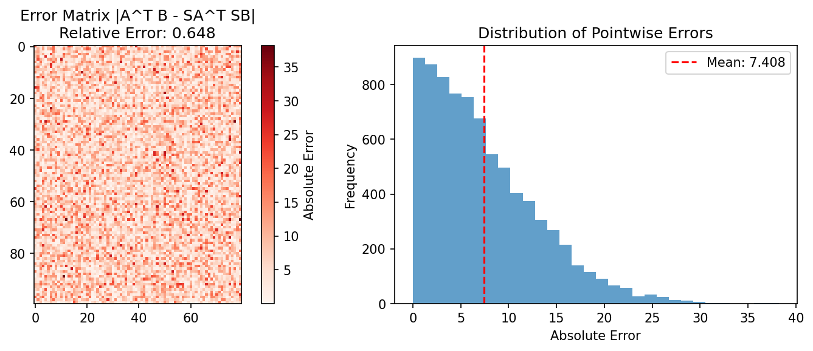

# Sparser Johnson-Lindenstrauss Transforms

## Authors

- [Daniel M. Kane](https://arxiv.org/search/?searchtype=author&query=Daniel%20M.%20Kane)
- [Jelani Nelson](https://arxiv.org/search/?searchtype=author&query=Jelani%20Nelson)

**ArXiv:** [1012.1577](https://arxiv.org/abs/1012.1577)

## Abstract

We give two different and simple constructions for dimensionality reduction in $\ell_2$ via linear mappings that are sparse: only an $O(\varepsilon)$-fraction of entries in each column of our embedding matrices are non-zero to achieve distortion $1+\varepsilon$ with high probability, while still achieving the asymptotically optimal number of rows. These are the first constructions to provide subconstant sparsity for all values of parameters, improving upon previous works of Achlioptas (JCSS 2003) and Dasgupta, Kumar, and Sarlós (STOC 2010). Such distributions can be used to speed up applications where $\ell_2$ dimensionality reduction is used.

## Description

Implementation of sparse Johnson-Lindenstrauss transforms with block and graph constructions achieving O(ε^-1 log(1/δ)) sparsity

## Implementation

See [`Sparse_Johnson_Lindenstrauss_arxiv_1012_1577.py`](./Sparse_Johnson_Lindenstrauss_arxiv_1012_1577.py) for the full implementation.

## Results

### Figure 1

### Figure 2

### Figure 3

