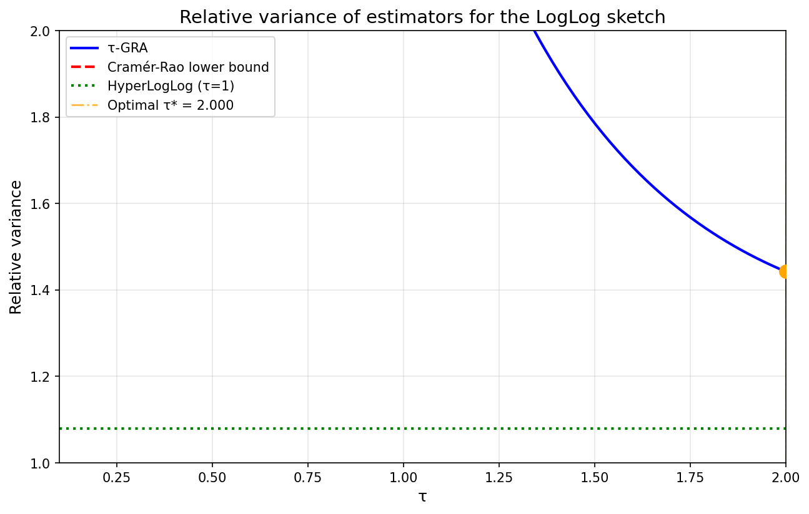
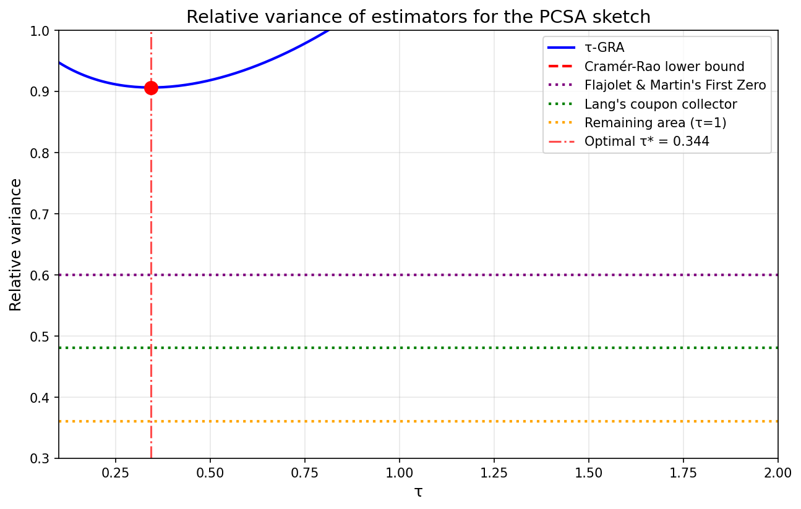
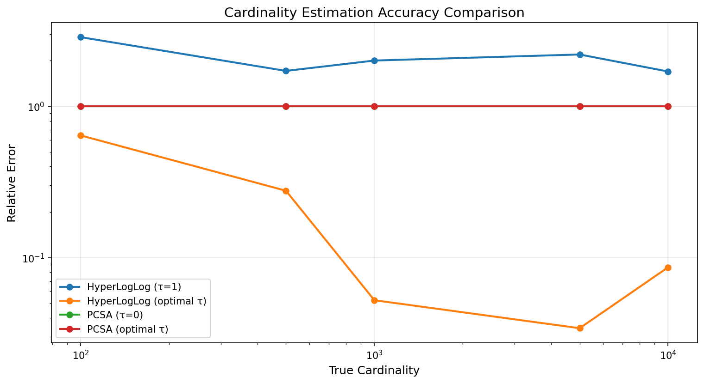

# Simpler and Better Cardinality Estimators for HyperLogLog and PCSA

## Paper Reference

**"Simpler and Better Cardinality Estimators for HyperLogLog and PCSA"**

**Authors:** [Seth Pettie](https://arxiv.org/search/?searchtype=author&query=Seth%20Pettie), [Dingyu Wang](https://arxiv.org/search/?searchtype=author&query=Dingyu%20Wang)

**ArXiv:** [2208.10578v1](https://arxiv.org/abs/2208.10578v1)

## Abstract

> \emph{Cardinality Estimation} (aka \emph{Distinct Elements}) is a classic problem in sketching with many industrial applications. Although sketching \emph{algorithms} are fairly simple, analyzing the cardinality \emph{estimators} is notoriously difficult, and even today the state-of-the-art sketches such as HyperLogLog and (compressed) \PCSA{} are not covered in graduate level Big Data courses. In this paper we define a class of \emph{generalized remaining area} (\tGRA) estimators, and observe that HyperLogLog, LogLog, and some estimators for PCSA are merely instantiations of \tGRA{} for various integral values of $τ$. We then analyze the limiting relative variance of \tGRA{} estimators. It turns out that the standard estimators for HyperLogLog and PCSA can be improved by choosing a \emph{fractional} value of $τ$. The resulting estimators come \emph{very} close to the Cramér-Rao lower bounds for HyperLogLog{} and PCSA derived from their Fisher information. Although the Cramér-Rao lower bound \emph{can} be achieved with the Maximum Likelihood Estimator (MLE), the MLE is cumbersome to compute and dynamically update. In contrast, \tGRA{} estimators are trivial to update in constant time. Our presentation assumes only basic calculus and probability, not any complex analysis~\cite{FlajoletM85,DurandF03,FlajoletFGM07}.

## Description

Implementation of τ-GRA (Generalized Remaining Area) estimators for HyperLogLog and PCSA cardinality estimation sketches with optimal variance analysis

## Implementation

See [`Tau_GRA_Cardinality_Estimator_arxiv_2208_10578v1.py`](./Tau_GRA_Cardinality_Estimator_arxiv_2208_10578v1.py) for the full implementation.

## Results

### Figure 1

### Figure 2

### Figure 3

