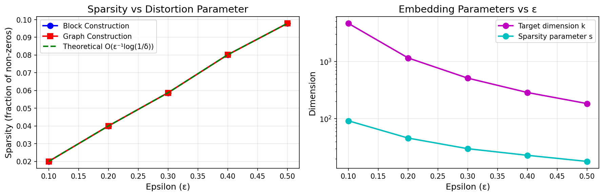
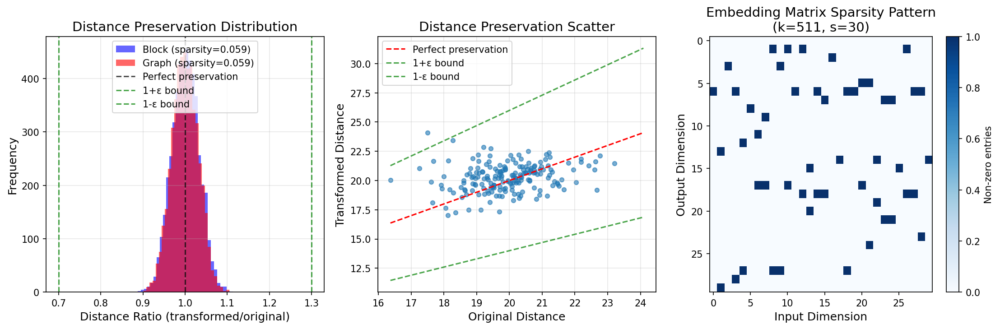
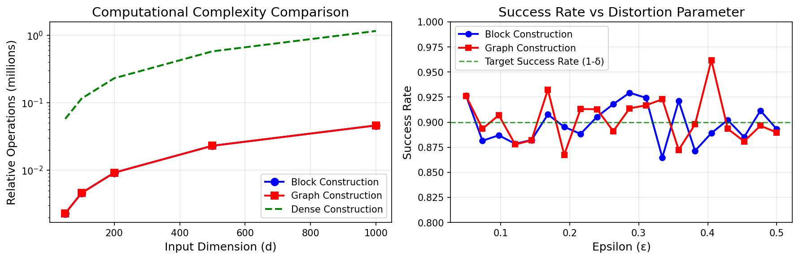

# Sparser Johnson-Lindenstrauss Transforms

Implementation of the Sparse Johnson-Lindenstrauss Transform with block and graph constructions, achieving O(ε^-1 log(1/δ)) sparsity for dimensionality reduction

**ArXiv:** [1012.1577](https://arxiv.org/abs/1012.1577)

## Implementation

See [`sparse_johnson_lindenstrauss.py`](./sparse_johnson_lindenstrauss.py) for the full implementation.

## Results

### Figure 1

### Figure 2

### Figure 3

---

*Generated with [Arxiv to Code](https://github.com/IgorCarron/arxiv-to-code)*
